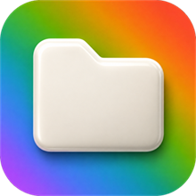
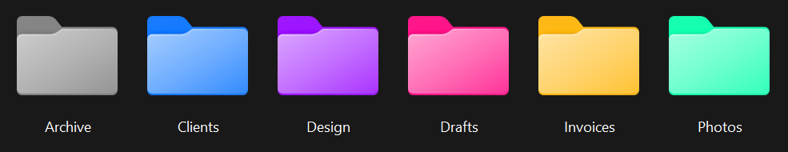
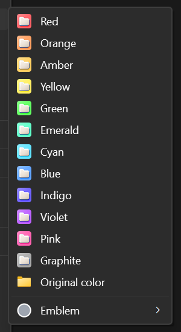

<div align="center">



# FolderHue

**Color-code your folders from the Windows right-click menu.**

[](#requirements)
[](https://github.com/0xpvcd/FolderHue/releases/latest)
[](https://github.com/0xpvcd/FolderHue/releases)
[](LICENSE)

</div>



Windows lets you change a folder icon, but only one folder at a time, through a dialog four
clicks deep, and only if you already have an `.ico` file lying around. FolderHue turns that into
a right-click: pick a color, and the folder takes it. Pick five folders first, and all five take
it at once.

It is a native shell extension, not a launcher or a background app. Nothing runs when you are not
using it.

## Install

1. Download **FolderHue-Setup.exe** from the [latest release](https://github.com/0xpvcd/FolderHue/releases/latest).
2. Run it. No administrator rights are needed — FolderHue installs for your user account only.
3. Right-click any folder.

The installer restarts File Explorer at the end. That is not optional: Windows caches shell
extensions, and the menu entry will not appear until Explorer has been restarted.

> **Windows will warn you the first time.** The installer is not code-signed — a certificate costs
> a few hundred euros a year — so SmartScreen shows *"Windows protected your PC"*. Click
> **More info**, then **Run anyway**. If that is a dealbreaker, build from source instead; the
> instructions are below and the build is reproducible.

> **On Windows 11, look under "Show more options"** (or press <kbd>Shift</kbd>+<kbd>F10</kbd>).
> Windows 11 reserves its short context menu for applications distributed through the Microsoft
> Store, so FolderHue appears in the full menu underneath it. On Windows 10 it appears directly.

## What you get



**Twelve colors** — red, orange, amber, yellow, green, emerald, cyan, blue, indigo, violet, pink
and graphite. They are derived from *your* Windows folder icon, so a colored folder still looks
like a folder on your machine, with the same shading and the same proportions.

**Original color** puts the default icon back without removing anything else.

**Emblems** — a small badge in the corner for *important*, *in progress*, *done*, *locked* or
*favorite*. An emblem is independent of the color: adding one to a folder you never colored
leaves its icon alone.

**Multiple selection** — select any number of folders, apply once.

**Reset color** removes everything FolderHue added to that folder, and nothing else.

<br clear="right">

## How it works

No background process, and no icon overlay slot — Windows only loads about fifteen overlay
handlers in total, and OneDrive, Dropbox and Git have usually taken them all. FolderHue uses the
mechanism Windows itself uses for custom folder icons:

1. A multi-resolution `.ico` is generated once per color and emblem, in
   `%LOCALAPPDATA%\FolderHue\icons`. Coloring is a hue rotation in HSL space, which keeps the
   original shading and transparency — a plain RGB multiply gives a flat, muddy result.
2. The folder gets a `desktop.ini` pointing at that icon, merged with any `desktop.ini` already
   there rather than overwriting it.
3. `SHGetSetFolderCustomSettings` tells Explorer to repaint, so open windows update immediately.

A journal in `%LOCALAPPDATA%\FolderHue\applied.json` records what was changed. That is what makes
resetting clean: the read-only attribute is removed only if FolderHue set it, and a `desktop.ini`
that existed beforehand is restored rather than deleted.

The base icon is read from your machine with `SHGetStockIconInfo`, so no Microsoft artwork is
redistributed.

## Limits worth knowing before you install

- **The icon does not travel.** `desktop.ini` stores an absolute path inside your user profile.
  Move the folder to another machine, a network share or a USB stick and it goes back to the
  default icon.
- **A hidden `desktop.ini` appears in the folder.** Git and OneDrive may report it. Adding
  `desktop.ini` to `.gitignore` is usually the right answer.
- **System folders are refused, on purpose.** `C:\Windows`, `Program Files`, drive roots, junctions
  and symbolic links, and the Windows known folders — Documents, Pictures, Desktop and the rest —
  are all rejected with a message rather than modified.
- **x64 only.** The menu is an in-process extension, and Explorer cannot load an x64 extension on
  an ARM64 machine, emulation or not. An ARM64 build is possible but is not published today.

## Requirements

Windows 10 version 1809 (build 17763) or later, or Windows 11. Nothing else: the .NET runtime is
bundled, which is why the installer is around 50 MB.

## Uninstall

Settings → Installed apps → FolderHue, or run `unins000.exe` from the install folder.

Uninstalling removes the program and its registry entries and leaves your folders exactly as they
are. The uninstaller offers a checkbox — **off by default** — to restore the original icon of every
folder it colored. Your files are never touched either way.

## Build from source

```powershell
.\scripts\setup-prereqs.ps1     # .NET 8 SDK, C++ build tools, Inno Setup — once
.\scripts\build.ps1             # tests, NativeAOT shell, self-contained app, installer
```

The installer lands in `artifacts\FolderHue-Setup-1.0.0.exe`.

| Project | Role |
|---|---|
| `src/FolderHue.Core` | Business logic: HSL tinting, `.ico` writing, `desktop.ini` merging, protected paths, the journal. No graphics or shell dependency. |
| `src/FolderHue.Shell` | The context menu itself: a COM server implementing `IExplorerCommand`, compiled with **NativeAOT** because it is loaded inside `explorer.exe` and a managed extension would drag the CLR in with it. |
| `src/FolderHue.App` | Settings window and icon renderer — the only project that depends on `System.Drawing`. |
| `installer/` | Inno Setup script and the executable icon. |
| `tests/` | xUnit tests covering all of Core. |

There are no NuGet dependencies outside the test project.

## FAQ

**Does this change my files?**
No. It writes a `desktop.ini` inside the folder and sets the folder's read-only attribute — which
is what tells Explorer to read that file. It never touches what is in the folder.

**Why is the folder marked read-only afterwards?**
Because Explorer ignores `desktop.ini` otherwise. It does not make the folder's contents read-only,
and resetting removes the attribute if FolderHue was the one that set it.

**Can I use my own colors?**
Not in this version. The palette is fixed at twelve colors plus the original.

**Does it work with a custom Windows theme or dark mode?**
Yes. The icons are generated from your current Windows folder icon, whatever it looks like.

**Why does the first right-click after installing show nothing?**
Explorer needs restarting to pick the extension up; the installer does that for you. If you skipped
it, sign out and back in.

## Language

The menu and the settings window follow your Windows display language: English everywhere, French
on a French system. Adding a language means adding one `.resx` file to `src/FolderHue.Core/Resources`
— pull requests welcome.

## License

[MIT](LICENSE). Use it, fork it, ship it.
